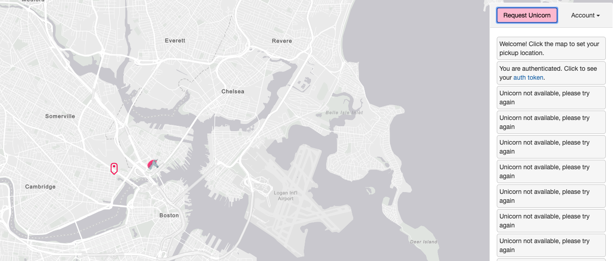

# Troubleshooting & Distributed tracing
In this module, we will explore the power of distributed tracing, and learn how
to troubleshoot using Epsagon.

# Instructions
### 1. Invoke the application
Here, we will simulate users using the application. Send some consecutive
requests, until you receive some "Unicorn not available" notifications. 

### 2. Inspect the transactions using Epsagon
With Epsagon, we can trace the entire flow of the data throughout the
application. we will start with a successful transaction.

First, enter the ["Functions"](https://dashboard.epsagon.com/functions) page and
select `wild-rydes-production-RequestUnicorn`. there you can see all the API
invocations in the system.
<!-- FIXME: add photo --> 
Then, select a successful invocation. Note that you can drill into the data of
every event.
<!-- FIXME: add photo --> 

### 3. Troubleshoot an error
Next, select a transaction with an error. Troubleshoot the root cause of the
error using it.

 Open to reveal the solution

 
When a user requests a unicorn and the selected one is not available, a message
is still being dispatched to the `UnicornDispached` SNS! This causes a faulty
message to pass downstream and 

